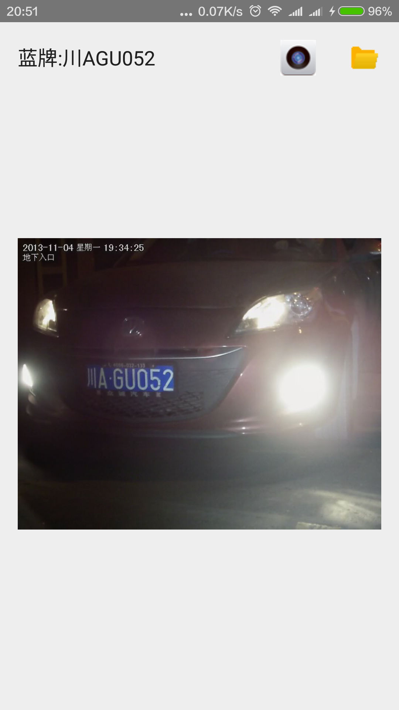

CarPlateAndroid，基于[EasyPR](https://github.com/liuruoze/EasyPR)1.5beta的android实现

特性：

1.支持拍照识别

2.支持图库浏览识别

3.ndk调用OpenCV

4.从assets读取并复制文件

5.采用多线程进行识别处理

6.支持单击切换原图和识别结果之间的切换

采用android studio1.3开发实现，ndk版本为R10d，OpenCV版本为3.1，android SDK版本为23。

app启动时会默认从assets加载测试图片，并进行识别，返回结果。点击相机按钮进行拍照识别，点击文件夹按钮从图库选择文件进行识别（兼容android 4.4版本及以上）。
